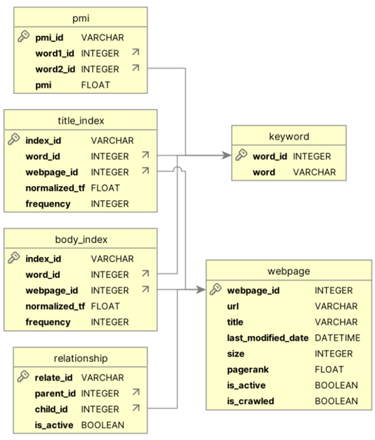

# COMP4321 Project
UST COMP4321 Search Engine Project

Demo Video URL: https://youtu.be/X005Ww9pGyY 

## Installation

### Tools and Library Used
- Web crawler written in Python 3.11.5
- `nltk` for text tokenization and stemming
- `rake-nltk` for phrasal keyword extraction
- `sqlite3` database for storing web crawling results
- `sqlalchemy` for accessing and manipulating with database
- `requests` for requesting webpage data
- `beautifulsoup4` for parsing webpage content
- `fastapi` and `uvicorn` for establishing API connection from frontend
- `Node.JS` and `Next.JS` for front-end development

### Server Setup
- Open a terminal.
- Start a python virtual environment.
- Go to `server` folder by running `cd server` in command line.
- Run `pip install -r requirements.txt` in command line to install necessary libraries and packages.
- Run `spider.py` to crawl 300 pages. Normal crawling takes around 1-2 minutes to complete.
- Run `bonus.py` to pre-compute PageRank and PMI. This should take less than 6 minutes.
- Run `uvicorn main:app --reload` to start the server.
- Record the server URL, which will be used in client setup.

### Client Setup
- Install Typescript, Node.js and Next.js.
- Open another terminal (keep server terminal running).
- Go to `client` folder by running `cd client` in command line.
- Open `utils/api.ts` file and replace `api_url` constant with the server URL.
- Run `npm run dev` and click on the URL in the command line to view the webpage (in developer mode).

## Webpage Crawling

### Data Cleaning

Title and body from webpages has punctuation, multiple space, and new line character removed.

### Cyclic Relationship Handling

Children of the webpage includes all presented webpage URL in the webpage, no matter if the link redirects to the predecessor of the webpage or not.

### Keyword Extraction

`PorterStemmer` from `nltk` is used to stem single keywords from webpages (For details, please visit `extract_keywords` function from `server/utils.py`).

We assumed phrasal keywords from webpages contains only 2-3 single words.  `extract_keywords_from_text` and `get_ranked_phrases` function from `rake-nltk` are used to extract phrasal keywords from webpages (For details, please visit `extract_keywords` function from `server/utils.py`)

## Database Schemas
All database schemas are defined in `server/db/schemas.py`.

### Entity Relationship Diagram

#### Webpage Table
Storing webpage data and mapping between webpage ID and URL. Attributes include:
- `webpage_id`: ID of webpages. Primary key.
- `url`: URL to webpage.
- `title`: Webpage title.
- `last_modified_date`: Data of "Last-Modified" field in webpage header.
- `size`: Data of "Content-Length" field in webpage header.
- `pagerank`: PageRank of webpage.
- `is_active`: Check if the webpage is active. Broken link, uncrawled, safe-deleted or any webpage with error while requesting are marked as inactive and would not be shown in searching results.
- `is_crawled`: Check if the webpage is crawled. Uncrawled webpages are stored for recording the parent-child relationship in Relationship table and whould not be shown in searching results.

#### Keyword Table
Storing keywords extracted from webpage and mapping between keyword ID and keywords. Attributes include:
- `word_id`: ID of keyword. Primary key.
- `word`: Keyword string.

#### Relationship Table
Recording parent-child relationship between webpages. Attributes include:
- `relate_id`: ID of relationship composed of `parent_id` and `child_id`. Primary key.
- `parent_id`: ID of parent webpage. Foreign key from Webpage table.
- `child_id`: ID of child webpage. Foreign key from Webpage table.
- `is_active`: Check if current relationship is active. Set to false when the relationship is not found after crawling at least twice.

#### Title/ Body Index Table
Storing the data of keywords in webpages that are used during searching. Used as forward or inverted index files. Attributes include:
- `index_id`: Unique ID composed of `webpage_id` and `word_id`. Primary key.
- `webpage_id`: ID of webpage. Foreign key from Webpage table.
- `word_id`: ID of keyword. Foreign key from Keyword table.
- `frequency`: Frequency of the keyword in the webpage. Zero frequency is seen as safe-deleted and would not use in searching.

#### PMI Table
Storing PMI pre-computed, which is used to measure the co-occurence of 2 terms.
- `pmi_id`: Unique ID of PMI. Primary Key.
- `word1_id`: ID of first word. Foreign key from Keyword table.
- `word2_id`: ID of second word. Foreign key from Keyword table.
- `pmi`: PMI of the terms. for each unique terms, only the co-occuring terms with top 5 PMI which > 0 is recorded in database.

### Supporting Structures

#### URL ⇄ Page-ID Mapping

-   Implemented via the **Webpage** table's **url** and **webpage_id**
    fields.

-   Lookup Process:

    -   For a given URL, query the **Webpage** table to retrieve its
        **webpage_id**.

    -   For a given **webpage_id**, retrieve the URL from the same
        table.

#### Word ⇄ Word-ID Mapping

-   Implemented via the **Keyword** table's **word** and **word_id**
    fields.

-   Lookup Process:

    -   For a stemmed keyword, query the **Keyword** table to retrieve
        its **word_id**.

    -   For a given **word_id**, retrieve the original stemmed keyword.

### Indexing Workflow

#### Crawling

-   BFS crawler fetches pages and populates the **Webpage** and
    **Relationship** tables.

-   Cyclic links are handled by checking **is_crawled** and
    **is_active** flags.

#### Keyword Extraction

-   Stop words are removed, and remaining words are stemmed.

-   Phrasal keywords (2-3 words) are extracted using RAKE.

#### Indexing

-   Keywords are stored in the **Keyword** table.

-   Frequencies are recorded in the **TitleIndex** and **BodyIndex** table.

## Searching

### Webpage Selection

Webpage with any terms matched with query is selected for ranking, while double quoted terms in query (either phrases or single word) should be appeared in all webpages as constraint.

### Webpage Document Vector

The term weighting in doument vector is the weighted average of the $TitleTFIDF$ and $BodyTFIDF$ of the terms. Both TFIDF are computed independently. To favor title matching, the weights are set to $TitleWeight:BodyWeight=7:3$.

$DocumentTermWeight(t) = 0.7 * TitleTFIDF(t) + 0.3 * BodyTFIDF(t)$

For term frequency shown in resulting webpages, we use the similar approach as calculating term weights. The frequencty hence should be in range of [0, 1]

$DocumentTF(t) = 0.7 * TITLETF(t) + 0.3 * BodyTF(t)$

### Query Vector

The term weighting in query vectors uses the same approach as document vector, where $TitleTFIDF$ and $BodyTFIDF$ uses the same $TF$ in query for calculation.

$QueryTermWeight(t) = TitleTFIDF(t) * 0.7 + BodyTFIDF(t) * 0.3$
$= TF(t) * TitleIDF(t) * 0.7 + TF(t) * BodyIDF(t) * 0.3$ 
$= TF(t) * (TitleIDF(t) * 0.7 + BodyIDF(t) * 0.3)$

### Similarity Score (Original)

The webpage similarity score uses the cosine similarity between document vector and queery vector. In front-end, this score is further normailized to [0, 100], and marked as "Original Score" (meaning it does not modified using any bonus feature as mentioned below)

$OriginalScore = CosineSimilarity(QueryVector, DocumentVector)$

## Bonus Feature

### PageRank

PageRank of each webpages crawled is pre-computed in backend and stored in the database before searching. It iterates 20 times with intial PageRank value set to 1 for computing.

PageRank score is min-max normalized, and then used to modify the similarity score with following formula:

$ModifiedScore = CosineSimilarity(QueryVector, DocumentVector) * 0.7 + NormalizedPageRank * 0.3$

### Relevance Feedback

While user searching, query history and webpage detail are recorded in the cookies, where document vector of webpages are only represented by terms with top 5 TFIDF. User can view, explicitly like or dislike the webpage. Liked and clicked pages has relevance score set to 1, while disliked page is set to -1.

On the next searching, top 5 similar queries with the given query (ranked by cosine similarity) are used to reformulate the query vector. The formula used to reformulate is modify from the one used to calculate the document vector centroid as stated in the lecture but with query similarity considered. This allows queries that are less relevant to given query (especially when user search for a new topic that is not searched before) will not weighted too much.  

In particular, given current query vector $q_c$ and webpages $A$ = set of $(q, d)$ where $d$ represents the document vector in hsitory and $q$ represents the corresponding query vector giving $D$ in history, then the following modification formula is given

$|A| = \sum CosineSimilarity(q, q_c)$ for all unique $q \in A$

$Centroid(A, q_c) = \sum (\frac{CosineSimilarity(q, q_c)}{|A|} * d) \forall (q, d) \in A$

$q_c' = q_c + 0.5 * Centroid(LikedWebpages, q_c) + 0.5 * Centroid(ClickedWebpages, q_c) - 0.25 * Centroid(DislikedWebpages, q_c)$

Note that query with negative similarity is not considered in relevance feedback

### Co-occuring Terms (PMI)

PMI is used to measure the co-occurence. After crawling, PMI for each extracted terms in title and body are pre-computed. They are combined with weighted average with $title:body=7:3$ and stored in the database. The window size for PMI calculation is the entire text. 

While searching, terms with top 5 PMI with any terms in the query are selected. Their TFIDF is then computed to reformulate the query, with term frequency being the ratio of that of co-occuring term in original query vector. In particular, given $(a, b)$ are terms that co-occured with $a$ in original query and $PMI$ is the min-max normalized PMI of $(a, b)$, the TFIDF of b is given using following formula:

$TF(b) = 0.3 * PMI * TF(a)$
$TFIDF(b) =  TF(b)/maxTF * (0.3 * TitleIDF(b) + 0.7 * BodyIDF(b))$

### Similarity Score (Modified)

The query is modified using both relevance feedback and co-occuring terms. Then, the modified query vector is used for finding similar webpages with PageRank and cosine similarity considered. This gives the finalized similarity score, which is marked as "Modified Score", use for sorting, and normalized to [0, 100] in front-end.

### Query Suggestion

While user typing query, a menu of extended query is suggested to user. There are 4 type of query in suggestion, namely "Fuzzy-matched terms", "Simialr queries", "Co-occuring terms" and "Relevant terms". The last 2 uses the PMI and relevance feedback mechanism, where the ranked words retrieved is directly appended to the end of the query. "Fuzzy-matched terms" find all terms that fuzzily matched the individual keyword in search query, while the "Similar queries" suggest some queries from cookies that is similar to current search query (ranked by cosine similarity).

### Query History

User can view their search history in `/history` page. It shows the search query history, date of searching and the resulted webpages. Note that the webpage shows in history is not ranked by any score, and only viewed or liked webpage can be shown.

### Get Similar Pages

While searching or viewing history, user can get relevant pages from a page result. This will start a new search which contains only the top 5 frequent keyword as query for searching. User clicking "Get Simialr Page" will also considered page viewed with relevance score set to 1. 

### Advanced Search: Keyword Selection and Suggestion

In `/advanced_search_form` page, user can select keywords from database by searching. The search and suggestion algorithm is the same as normal query, but with individual words retrieved. 

User can also select keywords that COULD appear, MUST appear, or MUST NOT appear in title, body or entire webpage. This corresponds to the OR, AND, NOT in simple boolean model for searching. Selected keyword in one field cannot be re-selected in other keyword field.

Note that it is not neccessary for user to manually input query if there is keyword selected. This type of query is marked as "Keyword-base query"

### Advanced Search: Date Range

In `/advanced_search_form` page, user can select the date range for searching. This will filter out the webpages with `last_modified_date` not in range specified.

Note that at least a keyword must be selected or query must be inputted  for searching. Inputting only date range will return error.

### Advanced Search: Joined Query Searching

In `/advanced_search_form` page, user can join 2 or more query for searching. This query can be from history. There are 2 joining methods:

#### Merged Query

Merging the result of 2 or more, at most 5 queries.

#### Subquery

Searching a query from the result of another query. A subquery can only consist of 2 query (origianl query and subquery).

The original and modified similarity score of the resulted webpage from joined search would be their average across the queries. 

## Crawler File Description
- `server/utils.py`: Python file containing utility functions
- `server/stopwords.txt`: Text file storing stopwords to be removed while crawling and retrieval
- `server/spider.py`: Python file for web crawling and store to database
- `server/db/schemas.py`: Python file defining the schemas of database
- `server/db/database.py`: Python file containing functions interacting with the database, including inserting, updating and retrieving data
- `server/db/project.db`: SQLite database file for storing crawled data